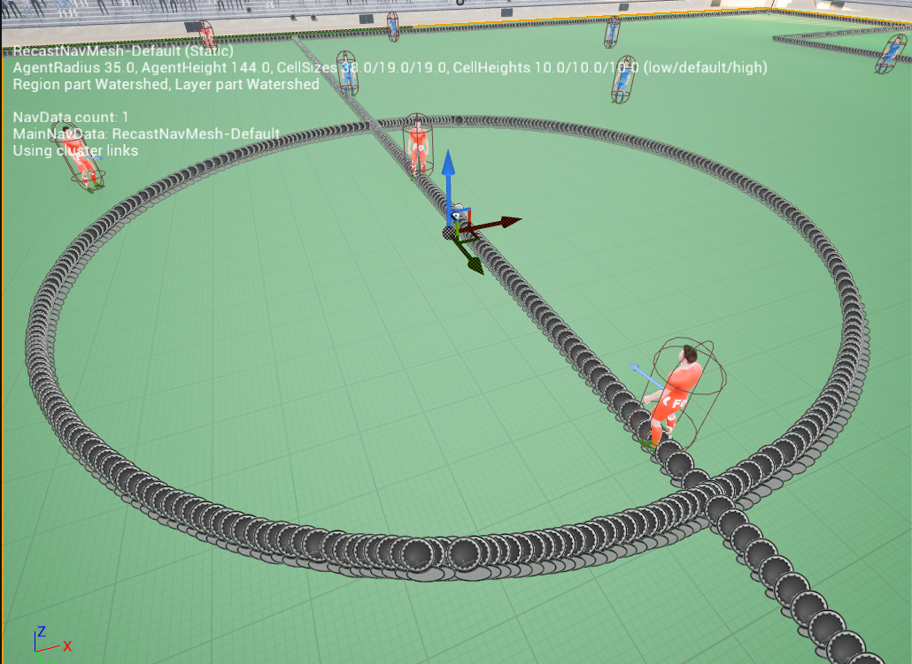

# SoccerSynth Field: enhancing field detection with synthetic data from virtual soccer simulator

**Abstract**

Field detection in team sports is an essential task in sports video analysis. However, collecting large-scale and diverse real-world datasets for training detection models is often cost and time-consuming. Synthetic datasets, which allow controlled variability in lighting, textures, and camera angles, will be a promising alternative for addressing these problems. This study addresses the challenges of high costs and difficulties in collecting real-world datasets by investigating the effectiveness of pretraining models using synthetic datasets. In this paper, we propose the effectiveness of using a synthetic dataset (SoccerSynth-Field) for soccer field detection. A synthetic soccer field dataset was created to pretrain models, and the performance of these models was compared with models trained on real-world datasets. The results demonstrate that models pretrained on the synthetic dataset exhibit superior performance in detecting soccer fields. This highlights the effectiveness of synthetic data in enhancing model robustness and accuracy, offering a cost-effective and scalable solution for advancing detection tasks in sports field detection.

link to the dataset:

https://drive.google.com/drive/folders/1WG-jx0n4PWB-hujxao0QEaKQB3GPBKjW?usp=drive_link

## Developer
<!-- ALL-CONTRIBUTORS-BADGE:START - Do not remove or modify this section -->
<!--  -->
<!-- ALL-CONTRIBUTORS-BADGE:END -->

<!-- ALL-CONTRIBUTORS-LIST:START - Do not remove or modify this section -->
<!-- prettier-ignore-start -->
<!-- markdownlint-disable -->

<table>
  <tbody>
    <tr>
<td align="center" valign="top" width="14.28%" style="min-height:150px;">
    <a href="https://github.com/qinhaobin1997">
         
        <b>Haobin Qin</b>
    </a>
     <a href="#Developer-HaobinQin" title="Lead Developer">💻</a>
</td>
<td align="center" valign="top" width="14.28%" style="min-height:150px;">
    <a href="https://github.com/FangJiale1999">
         
        <b>Fang Jiale</b>
    </a>
     <a href="#Coordinator-FangJiale1999" title="Developer">💻</a>
</td>
<td align="center" valign="top" width="14.28%" style="min-height:150px;">
    <a href="https://github.com/keisuke198619">
         
        <b>Keisuke Fujii</b>
    </a>
     <a href="#lead-KeisukeFujii" title="Team Leader">🧑‍💻</a>
</td>

  </tbody>
</table>
